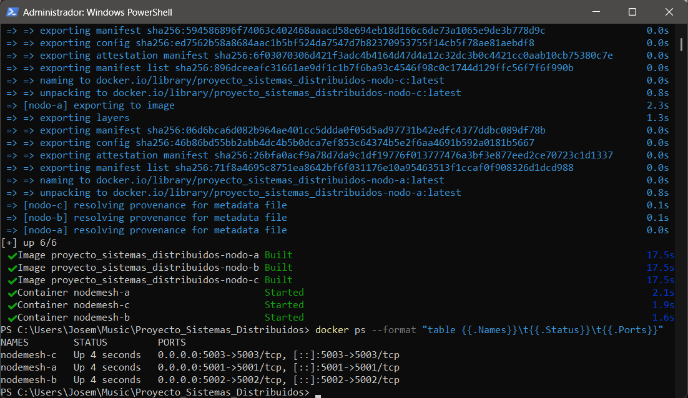
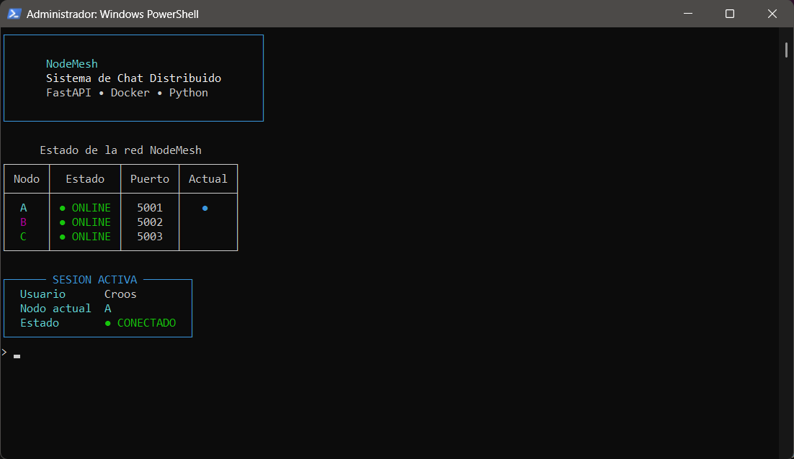
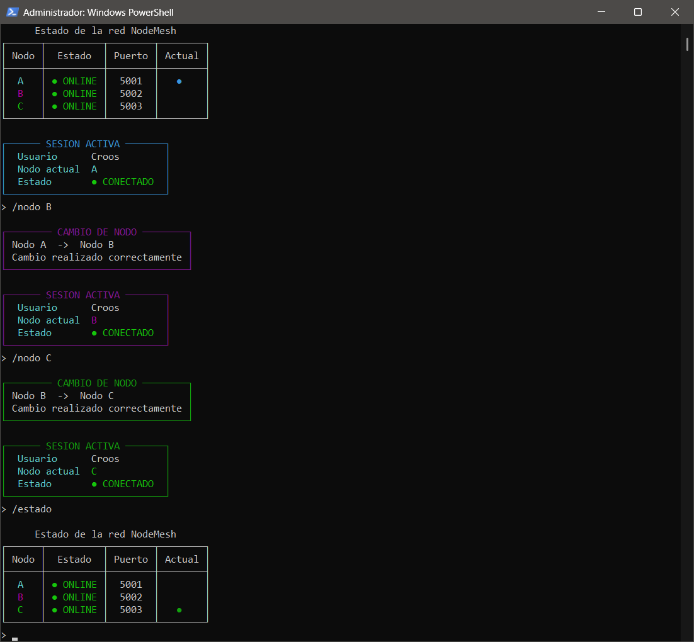
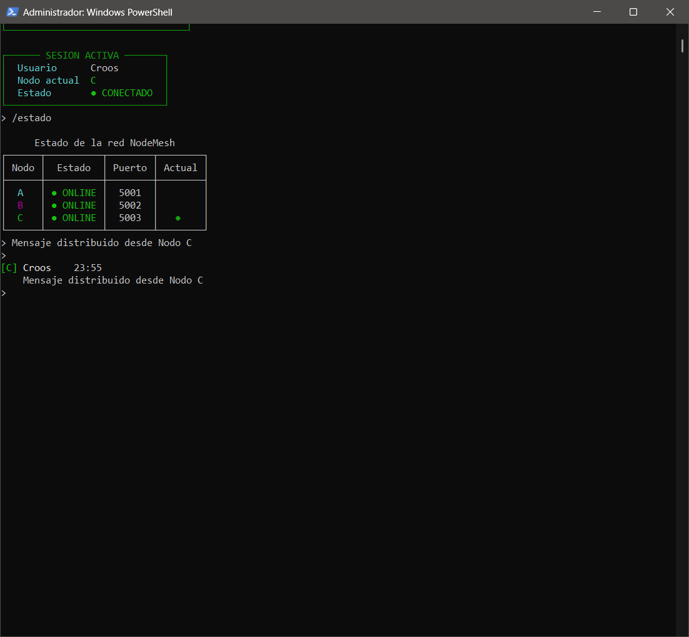
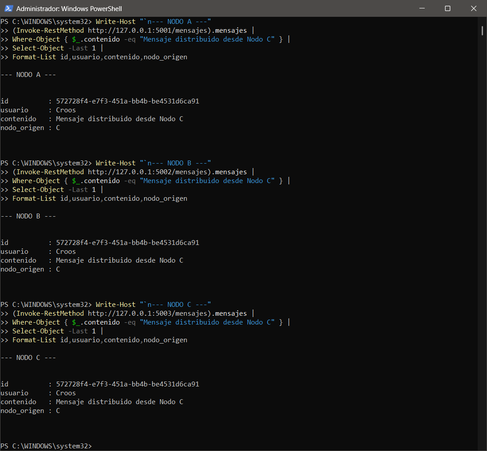
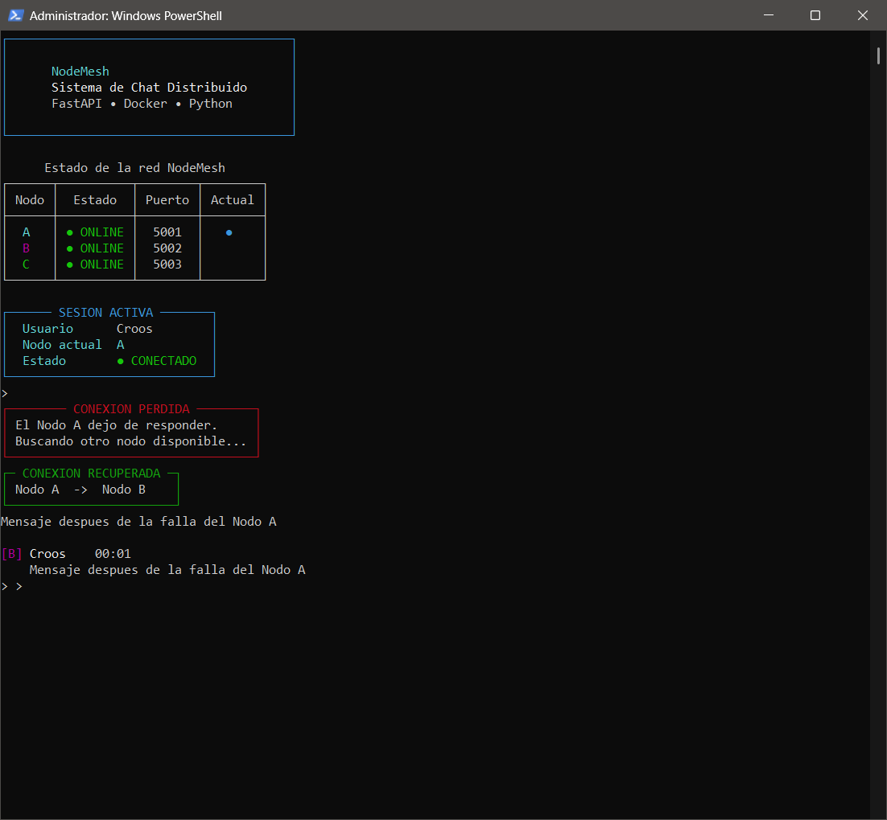
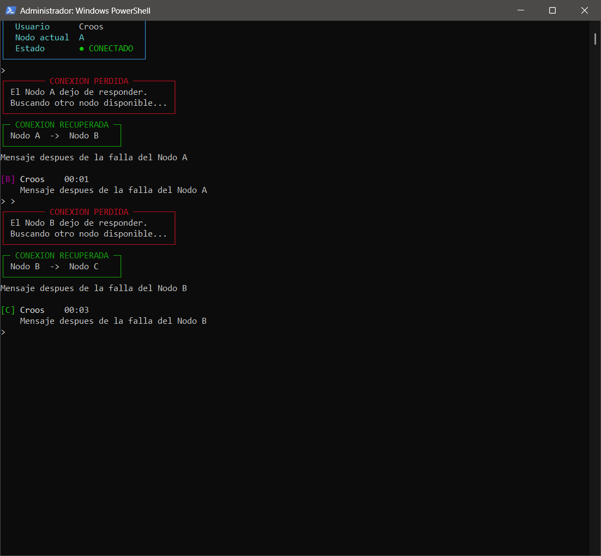
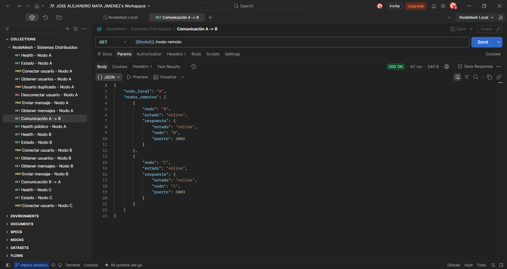
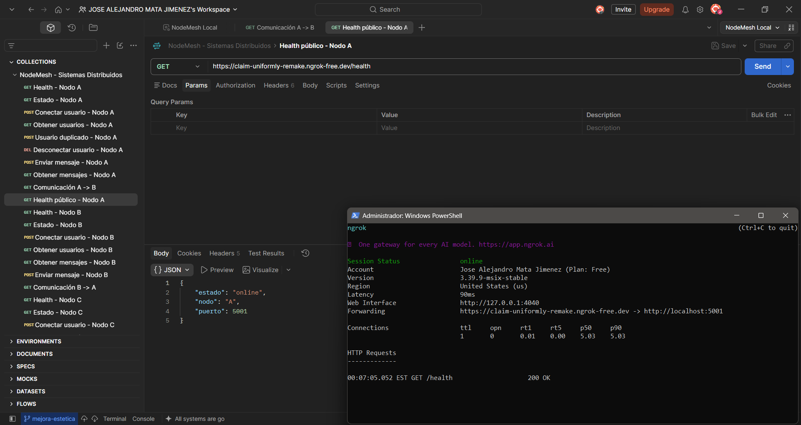
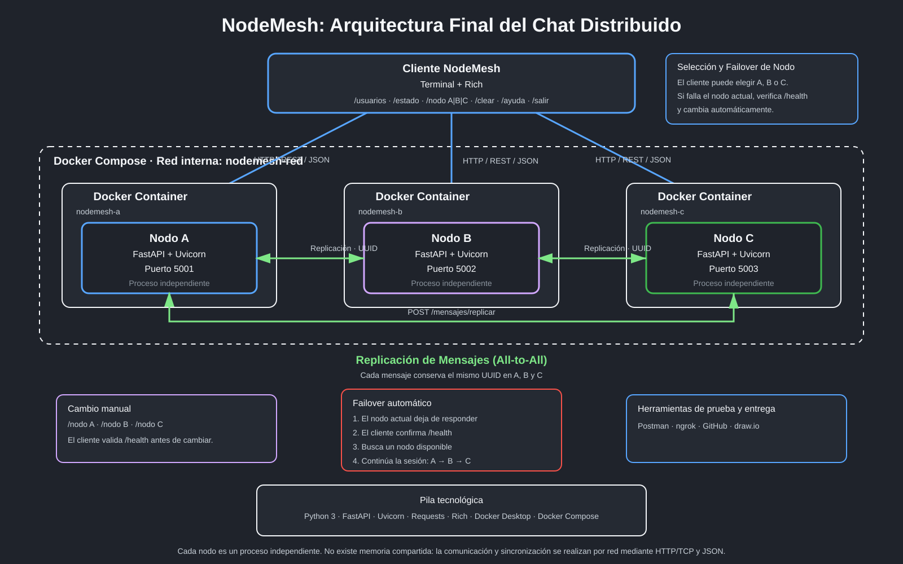

# NodeMesh - Sistema de Chat Distribuido


## Proyecto de Sistemas Distribuidos

**NodeMesh** es un sistema de chat distribuido desarrollado en Python como proyecto para la materia de Sistemas Distribuidos.

El proyecto parte de un chat cliente-servidor desarrollado anteriormente y evoluciona hacia una arquitectura compuesta por múltiples nodos independientes capaces de comunicarse mediante red, replicar mensajes, detectar fallos y mantener la continuidad del servicio cuando uno de los nodos deja de responder.

La versión final del sistema utiliza **tres nodos FastAPI**, un cliente de terminal, replicación de mensajes, tolerancia a fallos, cambio manual de nodo, Docker Compose, Postman y ngrok.

---

# Tabla de contenido

- [Arquitectura del sistema](#arquitectura-del-sistema)
- [Nodos del sistema](#nodos-del-sistema)
- [Comunicación entre nodos](#comunicación-entre-nodos)
- [Tolerancia a fallos](#tolerancia-a-fallos)
- [Tecnologías utilizadas](#tecnologías-utilizadas)
- [Estructura del proyecto](#estructura-del-proyecto)
- [Endpoints](#endpoints)
- [Usuarios](#usuarios)
- [Mensajes](#mensajes)
- [Replicación de mensajes](#replicación-de-mensajes)
- [Cliente terminal](#cliente-terminal)
- [Comandos del cliente](#comandos-del-cliente)
- [Cambio manual de nodo](#cambio-manual-de-nodo)
- [Failover automático](#failover-automático)
- [Diferencia entre cambio manual y failover](#diferencia-entre-cambio-manual-y-failover)
- [Docker](#docker)
- [Dockerfile](#dockerfile)
- [Docker Compose](#docker-compose)
- [Ejecución con Docker Compose](#ejecución-con-docker-compose)
- [Ejecución local](#ejecución-local)
- [Ejecutar el cliente](#ejecutar-el-cliente)
- [Dependencias](#dependencias)
- [Postman](#postman)
- [ngrok](#ngrok)
- [Pruebas realizadas](#pruebas-realizadas)
- [Evidencias finales](#evidencias-finales)
- [Entregable 1](#entregable-1---diseño-inicial)
- [Entregable 2](#entregable-2---primer-nodo)
- [Entregable 3](#entregable-3---conversión-a-sistema-distribuido)
- [Proyecto final](#proyecto-final)
- [Estado final del proyecto](#estado-final-del-proyecto)
- [Conclusión](#conclusión)

---

# Arquitectura del sistema

NodeMesh utiliza una arquitectura distribuida formada por tres nodos independientes.

```text
                         ┌───────────────────┐
                         │      Cliente      │
                         │    NodeMesh CLI   │
                         └─────────┬─────────┘
                                   │
                         HTTP / REST / JSON
                                   │
             ┌─────────────────────┼─────────────────────┐
             │                     │                     │
             ▼                     ▼                     ▼
      ┌─────────────┐       ┌─────────────┐       ┌─────────────┐
      │   Nodo A    │       │   Nodo B    │       │   Nodo C    │
      │   FastAPI   │◄─────►│   FastAPI   │◄─────►│   FastAPI   │
      │ Puerto 5001 │       │ Puerto 5002 │       │ Puerto 5003 │
      └──────┬──────┘       └──────┬──────┘       └──────┬──────┘
             │                     │                     │
             └──────────── Replicación ─────────────────┘
```

Cada nodo mantiene su propia memoria para usuarios y mensajes.

No existe memoria compartida entre los nodos.

Toda la comunicación se realiza mediante red.

---

# Nodos del sistema

El sistema final está compuesto por:

| Nodo   | Puerto | Framework |
| ------ | -----: | --------- |
| Nodo A |   5001 | FastAPI   |
| Nodo B |   5002 | FastAPI   |
| Nodo C |   5003 | FastAPI   |

Cada nodo ejecuta una instancia independiente del servidor.

Esto permite que un nodo pueda dejar de funcionar sin detener necesariamente el resto del sistema.

---

# Comunicación entre nodos

Los nodos se comunican mediante:

- HTTP sobre TCP.
- API REST.
- Formato JSON.
- Biblioteca `requests` para comunicación entre procesos.
- Endpoints de diagnóstico y replicación.

La comunicación no utiliza memoria compartida.

Cada nodo conoce las direcciones de los demás nodos y puede realizar peticiones HTTP hacia ellos.

Ejemplo:

```text
Nodo A
├── Nodo B
└── Nodo C

Nodo B
├── Nodo A
└── Nodo C

Nodo C
├── Nodo A
└── Nodo B
```

El endpoint:

```text
GET /nodo-remoto
```

permite comprobar la comunicación de un nodo con los demás.

Una respuesta puede mostrar:

```json
{
  "nodo_local": "A",
  "nodos_remotos": [
    {
      "nodo": "B",
      "estado": "online"
    },
    {
      "nodo": "C",
      "estado": "online"
    }
  ]
}
```

---

# Tolerancia a fallos

NodeMesh implementa tolerancia a fallos desde el cliente.

Cada nodo dispone del endpoint:

```text
GET /health
```

El cliente utiliza este endpoint para comprobar si un nodo realmente se encuentra disponible.

Si el nodo actual deja de responder:

1. El cliente detecta el error.
2. Comprueba `/health`.
3. Confirma que el nodo se encuentra fuera de servicio.
4. Busca otro nodo disponible.
5. Registra al usuario en el nodo alternativo.
6. Actualiza la conexión actual.
7. Continúa ejecutándose.

Ejemplo:

```text
Cliente
   │
   ▼
Nodo A
   │
   X  Falla
   │
   ▼
Nodo B
```

También se probaron fallos consecutivos:

```text
Nodo A
  X
  │
  ▼
Nodo B
  X
  │
  ▼
Nodo C
```

El cliente puede continuar trabajando mientras exista al menos otro nodo disponible.

---

# Versión de Python

El proyecto utiliza **Python 3**.

La evidencia de la versión utilizada se encuentra en:


---

# Tecnologías utilizadas

NodeMesh utiliza:

- Python 3
- FastAPI
- Uvicorn
- Requests
- Pydantic
- Rich
- Docker Desktop
- Docker Compose
- Git
- GitHub
- Postman
- ngrok
- draw.io
- PowerShell

---

# Estructura del proyecto

La estructura actual es:

```text
Proyecto_Sistemas_Distribuidos/
│
├── capturas/
│
├── cliente/
│   └── cliente.py
│
├── diagramas/
│   ├── arquitectura_distribuida.drawio
│   └── arquitectura_distribuida.png
│
├── nodo_a/
│   └── Main.py
│
├── nodo_b/
│   └── Main.py
│
├── nodo_c/
│   └── Main.py
│
├── postman/
│   ├── collections/
│   └── environments/
│
├── pruebas/
│
├── .dockerignore
├── .gitignore
├── docker-compose.yml
├── Dockerfile
├── README.md
└── requirements.txt
```

## Función de cada carpeta

### `nodo_a/`

Contiene la implementación del Nodo A.

Puerto:

```text
5001
```

### `nodo_b/`

Contiene la implementación del Nodo B.

Puerto:

```text
5002
```

### `nodo_c/`

Contiene la implementación del Nodo C.

Puerto:

```text
5003
```

### `cliente/`

Contiene el cliente terminal de NodeMesh.

El cliente permite:

- seleccionar nodo;
- conectar usuario;
- enviar mensajes;
- recibir mensajes;
- consultar usuarios;
- consultar estado;
- cambiar manualmente de nodo;
- realizar failover automático.

### `diagramas/`

Contiene el diagrama de arquitectura realizado con draw.io.

### `capturas/`

Contiene evidencias de las pruebas y entregables.

### `postman/`

Contiene las colecciones y entornos utilizados para probar la API.

### `pruebas/`

Directorio reservado para pruebas adicionales.

---

# Endpoints

Los nodos utilizan diferentes endpoints para manejar diagnóstico, usuarios, mensajes y comunicación distribuida.

---

## Diagnóstico

### Ruta principal

```http
GET /
```

Devuelve información general del nodo.

---

### Health

```http
GET /health
```

Permite comprobar si el nodo está activo.

Ejemplo:

```json
{
  "estado": "online",
  "nodo": "A",
  "puerto": 5001
}
```

---

### Estado

```http
GET /estado
```

Muestra información adicional como:

- nodo;
- puerto;
- estado;
- tiempo activo;
- usuarios conectados;
- mensajes locales.

Ejemplo:

```json
{
  "nodo": "A",
  "puerto": 5001,
  "estado": "online",
  "tiempo_activo_segundos": 120.25,
  "usuarios_conectados": 1,
  "mensajes_locales": 3
}
```

---

# Usuarios

## Conectar usuario

```http
POST /usuarios/conectar
```

Ejemplo:

```json
{
  "nombre": "Croos"
}
```

Respuesta:

```json
{
  "mensaje": "Usuario conectado correctamente",
  "usuario": "Croos",
  "nodo": "A"
}
```

---

## Obtener usuarios

```http
GET /usuarios
```

Ejemplo:

```json
{
  "nodo": "A",
  "total": 1,
  "usuarios": [
    {
      "nombre": "Croos",
      "nodo": "A",
      "estado": "conectado"
    }
  ]
}
```

---

## Desconectar usuario

```http
DELETE /usuarios/{nombre}
```

Ejemplo:

```text
DELETE /usuarios/Croos
```

---

# Mensajes

## Enviar mensaje

```http
POST /mensajes
```

Ejemplo:

```json
{
  "usuario": "Croos",
  "contenido": "Hola desde NodeMesh"
}
```

Cada mensaje contiene:

- UUID;
- usuario;
- contenido;
- nodo de origen;
- fecha.

Ejemplo:

```json
{
  "id": "d7b5afb2-fa66-4890-afb5-e14f62dc43bb",
  "usuario": "Croos",
  "contenido": "Hola desde NodeMesh",
  "nodo_origen": "A",
  "fecha": "2026-09-21T02:57:00+00:00"
}
```

---

## Obtener mensajes

```http
GET /mensajes
```

Devuelve los mensajes almacenados en el nodo.

Ejemplo:

```json
{
  "nodo": "A",
  "total": 1,
  "mensajes": [
    {
      "id": "d7b5afb2-fa66-4890-afb5-e14f62dc43bb",
      "usuario": "Croos",
      "contenido": "Hola desde NodeMesh",
      "nodo_origen": "C",
      "fecha": "2026-09-21T02:57:00+00:00"
    }
  ]
}
```

---

# Replicación de mensajes

La replicación permite que un mensaje recibido por un nodo sea enviado a los demás nodos disponibles.

Ejemplo:

```text
              Mensaje
                 │
                 ▼
              Nodo C
              /    \
             ▼      ▼
         Nodo A    Nodo B
```

El nodo que crea originalmente el mensaje genera un UUID.

El mismo UUID se conserva durante la replicación.

Esto permite identificar el mensaje como una única entidad dentro del sistema.

El endpoint utilizado internamente es:

```http
POST /mensajes/replicar
```

Una respuesta al enviar un mensaje puede incluir:

```json
{
  "mensaje": "Mensaje enviado correctamente",
  "replicado": true,
  "replicados": ["A", "B"],
  "fallidos": []
}
```

Esto indica que el mensaje fue creado en un nodo y replicado correctamente en los otros dos.

---

# Cliente terminal

NodeMesh incluye un cliente interactivo ubicado en:

```text
cliente/cliente.py
```

El cliente utiliza la biblioteca **Rich** para ofrecer una interfaz de terminal más clara.

Al iniciar se muestra:

- nombre del proyecto;
- estado de A, B y C;
- puerto de cada nodo;
- nodo actual;
- usuario conectado;
- estado de la sesión.

Ejemplo:

```text
NodeMesh
Sistema de Chat Distribuido
FastAPI • Docker • Python
```

El estado de red se muestra mediante una tabla:

```text
Nodo     Estado      Puerto     Actual

A        ONLINE      5001       ●
B        ONLINE      5002
C        ONLINE      5003
```

Los nodos utilizan colores diferentes:

```text
Nodo A → Cyan
Nodo B → Magenta
Nodo C → Verde
```

---

# Comandos del cliente

El cliente dispone de:

```text
/usuarios
/estado
/nodo A|B|C
/clear
/ayuda
/salir
```

---

## `/usuarios`

Muestra los usuarios conectados al nodo actual.

Ejemplo:

```text
Usuarios conectados - Nodo A

Usuario       Nodo       Estado
Croos         A          conectado
```

---

## `/estado`

Consulta los tres nodos.

Ejemplo:

```text
Estado de la red NodeMesh

Nodo     Estado      Puerto     Actual

A        ONLINE      5001       ●
B        ONLINE      5002
C        ONLINE      5003
```

---

## `/nodo`

Permite cambiar manualmente entre nodos.

Sintaxis:

```text
/nodo A
/nodo B
/nodo C
```

Ejemplo:

```text
> /nodo B

CAMBIO DE NODO

Nodo A -> Nodo B
Cambio realizado correctamente
```

Después del cambio, la sesión se actualiza:

```text
SESION ACTIVA

Usuario       Croos
Nodo actual   B
Estado        CONECTADO
```

Si el nodo solicitado está apagado:

```text
> /nodo A

Error: El Nodo A no esta disponible
```

En ese caso el cliente conserva la conexión existente.

---

## `/clear`

Limpia la terminal.

Después vuelve a mostrar:

- banner;
- estado de red;
- nodo actual;
- sesión activa.

---

## `/ayuda`

Muestra todos los comandos disponibles.

---

## `/salir`

Desconecta al usuario y termina el cliente.

---

# Cambio manual de nodo

NodeMesh permite cambiar libremente entre nodos sin tener que cerrar el cliente.

Ejemplo:

```text
Nodo A
  │
  │ /nodo B
  ▼
Nodo B
  │
  │ /nodo C
  ▼
Nodo C
```

El cliente comprueba `/health` antes de realizar el cambio.

El usuario solo es movido si el nodo seleccionado está disponible.

Esto permite demostrar que el cliente no depende permanentemente de un único servidor.

---

# Failover automático

Además del cambio manual, NodeMesh implementa cambio automático cuando ocurre una falla.

Ejemplo:

```text
Cliente conectado a Nodo A
          │
          ▼
       Nodo A
          X
          │
          ▼
       Nodo B
```

En la interfaz se muestra:

```text
CONEXION PERDIDA

El Nodo A dejo de responder.
Buscando otro nodo disponible...
```

Posteriormente:

```text
CONEXION RECUPERADA

Nodo A -> Nodo B
```

El cliente puede continuar enviando mensajes desde el nuevo nodo.

También se comprobó:

```text
A falla
↓
B

B falla
↓
C
```

---

# Diferencia entre cambio manual y failover

NodeMesh implementa dos mecanismos distintos.

## Cambio manual

Es solicitado directamente por el usuario:

```text
/nodo C
```

Ejemplo:

```text
A -> C
```

## Failover automático

Ocurre cuando el cliente detecta que el nodo actual dejó de responder.

Ejemplo:

```text
A falla
↓
B
```

El primero depende de una decisión del usuario.

El segundo forma parte de la tolerancia a fallos del sistema.

---

# Docker

NodeMesh utiliza Docker para ejecutar cada nodo dentro de un contenedor independiente.

Contenedores:

```text
nodemesh-a
nodemesh-b
nodemesh-c
```

Puertos:

| Contenedor | Puerto |
| ---------- | -----: |
| nodemesh-a |   5001 |
| nodemesh-b |   5002 |
| nodemesh-c |   5003 |

Docker Compose permite crear los tres servicios y conectarlos mediante una misma red.

---

# Dockerfile

El archivo:

```text
Dockerfile
```

define la imagen utilizada para ejecutar los nodos.

La imagen instala las dependencias necesarias y permite iniciar las aplicaciones FastAPI dentro de los contenedores.

---

# Docker Compose

El archivo:

```text
docker-compose.yml
```

permite iniciar la arquitectura completa.

Los tres contenedores utilizan una red interna de Docker para comunicarse.

Conceptualmente:

```text
Docker Network
│
├── nodemesh-a
├── nodemesh-b
└── nodemesh-c
```

---

# Ejecución con Docker Compose

Primero es necesario tener Docker Desktop ejecutándose.

Desde la carpeta raíz:

```powershell
docker compose up -d --build
```

Este comando:

1. construye las imágenes;
2. crea la red;
3. crea los contenedores;
4. inicia los tres nodos.

---

## Comprobar contenedores

```powershell
docker ps
```

Resultado esperado:

```text
nodemesh-a     Up
nodemesh-b     Up
nodemesh-c     Up
```

---

## Ver logs

```powershell
docker compose logs -f
```

---

## Detener todo el sistema

```powershell
docker compose down
```

---

## Detener un nodo

Ejemplo:

```powershell
docker stop nodemesh-a
```

---

## Iniciar nuevamente un nodo

```powershell
docker start nodemesh-a
```

---

# Ejecución local

También es posible ejecutar los nodos sin Docker.

Primero activar el entorno virtual:

```powershell
.\venv\Scripts\Activate.ps1
```

---

## Nodo A

```powershell
python -m uvicorn nodo_a.Main:app --host 0.0.0.0 --port 5001
```

---

## Nodo B

```powershell
python -m uvicorn nodo_b.Main:app --host 0.0.0.0 --port 5002
```

---

## Nodo C

```powershell
python -m uvicorn nodo_c.Main:app --host 0.0.0.0 --port 5003
```

---

# Ejecutar el cliente

Con los nodos activos:

```powershell
python .\cliente\cliente.py
```

Al iniciar:

```text
Selecciona un nodo [A/B/C]:
```

Después se solicita:

```text
Nombre de usuario:
```

Una vez conectado puede comenzar el intercambio de mensajes.

---

# Dependencias

Las dependencias del proyecto están incluidas en:

```text
requirements.txt
```

Para instalarlas:

```powershell
pip install -r requirements.txt
```

Entre las dependencias principales se encuentran:

```text
FastAPI
Uvicorn
Requests
Rich
```

---

# Postman

Postman fue utilizado para probar los endpoints durante todo el desarrollo.

El entorno utilizado es:

```text
NodeMesh Local
```

Variables:

```text
NodoA = http://127.0.0.1:5001
NodoB = http://127.0.0.1:5002
NodoC = http://127.0.0.1:5003
```

Ejemplos:

```text
{{NodoA}}/health
{{NodoB}}/estado
{{NodoC}}/mensajes
```

La colección incluye pruebas para:

- health;
- estado;
- usuarios;
- mensajes;
- comunicación entre nodos;
- replicación.

---

# ngrok

ngrok fue utilizado para exponer temporalmente un nodo local mediante Internet.

Ejemplo conceptual:

```text
Internet
   │
   ▼
URL pública ngrok
   │
   ▼
localhost:5001
   │
   ▼
Nodo A
```

Se comprobó el endpoint público:

```text
GET /health
```

También se realizaron pruebas de replicación mediante la URL pública.

Esto permitió comprobar que el servicio podía recibir peticiones externas y no únicamente conexiones desde localhost.

---

# Pruebas realizadas

Durante el desarrollo se realizaron diferentes pruebas.

---

## Prueba 1 - Health

Se verificó:

```text
GET /health
```

en A, B y C.

Resultado:

```text
200 OK
```

---

## Prueba 2 - Estado

Se verificó:

```text
GET /estado
```

en los diferentes nodos.

---

## Prueba 3 - Usuarios

Se comprobaron:

```text
POST /usuarios/conectar
GET /usuarios
DELETE /usuarios/{nombre}
```

También se comprobó el rechazo de usuarios duplicados.

---

## Prueba 4 - Mensajes

Se enviaron mensajes mediante:

```text
POST /mensajes
```

y posteriormente se consultaron con:

```text
GET /mensajes
```

---

## Prueba 5 - Comunicación entre nodos

Se comprobó:

```text
GET /nodo-remoto
```

desde cada nodo.

Los resultados confirmaron comunicación:

```text
A -> B y C
B -> A y C
C -> A y B
```

---

## Prueba 6 - Replicación

Se envió un mensaje desde un nodo.

Ejemplo:

```text
Nodo C
```

Posteriormente el mismo mensaje fue visible en:

```text
Nodo A
Nodo B
Nodo C
```

con el mismo UUID.

---

## Prueba 7 - Cliente terminal

Dos clientes conectados a nodos diferentes pudieron visualizar mensajes del sistema distribuido.

---

## Prueba 8 - Cambio manual

Se comprobó:

```text
/nodo B
/nodo C
/nodo A
```

Resultado:

```text
A -> B
B -> C
C -> A
```

---

## Prueba 9 - Nodo no disponible

Se intentó cambiar manualmente hacia un nodo apagado.

Resultado:

```text
Error: El Nodo A no esta disponible
```

El cliente permaneció conectado al nodo actual.

---

## Prueba 10 - Failover

Con el cliente conectado a A:

```powershell
docker stop nodemesh-a
```

Resultado:

```text
Nodo A -> Nodo B
```

El cliente pudo seguir enviando mensajes.

---

## Prueba 11 - Failover consecutivo

Después de cambiar automáticamente a B:

```powershell
docker stop nodemesh-b
```

Resultado:

```text
Nodo B -> Nodo C
```

El servicio continuó disponible.

---

## Prueba 12 - Docker Compose

Se ejecutó:

```powershell
docker compose up -d --build
```

y se comprobaron los tres contenedores activos.

---

# Evidencias finales

Las siguientes capturas documentan el funcionamiento de la versión final de NodeMesh.

## 1. Tres nodos ejecutándose con Docker Compose



Se observan los contenedores `nodemesh-a`, `nodemesh-b` y `nodemesh-c` ejecutándose en los puertos 5001, 5002 y 5003.

---

## 2. Estado de la red desde el cliente



El cliente muestra los tres nodos disponibles y la sesión activa.

---

## 3. Cambio manual entre nodos



Se demuestra el cambio manual A → B → C mediante el comando `/nodo`.

---

## 4. Envío de mensaje distribuido



Se envía un mensaje utilizando el Nodo C.

---

## 5. Replicación con el mismo UUID



El mismo mensaje aparece en A, B y C conservando exactamente el mismo UUID.

---

## 6. Failover de Nodo A a Nodo B



El cliente detecta la caída del Nodo A, cambia automáticamente al Nodo B y continúa enviando mensajes.

---

## 7. Failover consecutivo de Nodo B a Nodo C



Después de la caída de A, también se detiene B y el cliente continúa funcionando mediante C.

---

## 8. Comunicación entre nodos mediante Postman



El Nodo A detecta correctamente a los nodos B y C mediante `/nodo-remoto`.

---

## 9. Acceso público mediante ngrok



Se demuestra el acceso al endpoint `/health` del Nodo A mediante una URL pública de ngrok.

---

## 10. Arquitectura final



Diagrama final de la arquitectura distribuida de NodeMesh.

---

# Entregable 1 - Diseño inicial

## Objetivo

Definir la arquitectura inicial del proyecto.

Se establecieron:

- tres nodos;
- comunicación mediante HTTP sobre TCP;
- API REST;
- intercambio JSON;
- ausencia de memoria compartida;
- tolerancia a fallos;
- repositorio GitHub;
- diagrama inicial de arquitectura.

También se agregó evidencia de la versión de Python utilizada.

---

# Entregable 2 - Primer nodo

## Objetivo

Implementar y probar el primer nodo del sistema.

En esta etapa se trabajó únicamente con:

```text
Nodo A
Puerto 5001
```

Tecnologías:

- Python;
- FastAPI;
- Uvicorn;
- Postman.

Ejecución:

```powershell
python -m uvicorn nodo_a.Main:app --host 0.0.0.0 --port 5001
```

En esta etapa se desarrollaron funcionalidades como:

- `/`;
- `/health`;
- `/estado`;
- usuarios;
- mensajes.

Postman fue utilizado como cliente para comprobar las peticiones HTTP.

---

# Entregable 3 - Conversión a Sistema Distribuido

## Objetivo

Convertir el nodo individual en un sistema distribuido.

Inicialmente se implementaron:

```text
Nodo A - 5001
Nodo B - 5002
```

Posteriormente se añadió el Nodo C.

Durante esta etapa se implementaron:

- comunicación nodo a nodo;
- `/nodo-remoto`;
- replicación de mensajes;
- UUID;
- sincronización de mensajes;
- Postman;
- ngrok;
- comunicación A ↔ B;
- pruebas de mensajes replicados.

La arquitectura evolucionó posteriormente hacia tres nodos completamente interconectados.

---

# Proyecto final

La versión final de NodeMesh incorpora:

- tres nodos independientes;
- Nodo A;
- Nodo B;
- Nodo C;
- FastAPI;
- HTTP/TCP;
- API REST;
- JSON;
- usuarios;
- mensajes;
- UUID;
- replicación;
- comunicación completa A/B/C;
- cliente terminal;
- interfaz Rich;
- estado visual de red;
- cambio manual de nodo;
- detección de disponibilidad;
- failover automático;
- tolerancia a múltiples fallos;
- Docker;
- Docker Compose;
- red interna;
- Postman;
- ngrok;
- Git;
- GitHub.

---

# Estado final del proyecto

| Funcionalidad       | Estado |
| ------------------- | ------ |
| Nodo A              | ✅     |
| Nodo B              | ✅     |
| Nodo C              | ✅     |
| FastAPI             | ✅     |
| API REST            | ✅     |
| HTTP/TCP            | ✅     |
| JSON                | ✅     |
| Usuarios            | ✅     |
| Mensajes            | ✅     |
| UUID                | ✅     |
| Replicación         | ✅     |
| Comunicación A ↔ B  | ✅     |
| Comunicación A ↔ C  | ✅     |
| Comunicación B ↔ C  | ✅     |
| Cliente terminal    | ✅     |
| Interfaz Rich       | ✅     |
| `/usuarios`         | ✅     |
| `/estado`           | ✅     |
| `/nodo A\|B\|C`     | ✅     |
| `/clear`            | ✅     |
| `/ayuda`            | ✅     |
| Cambio manual       | ✅     |
| Health checks       | ✅     |
| Failover automático | ✅     |
| Failover A → B → C  | ✅     |
| Docker              | ✅     |
| Docker Compose      | ✅     |
| Red interna Docker  | ✅     |
| Postman             | ✅     |
| ngrok               | ✅     |
| GitHub              | ✅     |

---

# Conclusión

NodeMesh evolucionó desde una arquitectura tradicional cliente-servidor hacia un sistema distribuido compuesto por tres procesos independientes.

Los nodos se comunican exclusivamente mediante red utilizando HTTP y JSON.

El sistema permite replicar mensajes entre nodos, detectar fallos y continuar operando mediante otro nodo disponible.

Además, el cliente permite cambiar manualmente de servidor y realiza failover automático cuando detecta que el nodo actual ha dejado de responder.

Docker y Docker Compose permiten ejecutar los tres nodos de manera aislada dentro de contenedores conectados por una red común.

El proyecto demuestra conceptos fundamentales de Sistemas Distribuidos como:

- comunicación entre procesos;
- independencia de nodos;
- replicación;
- identificadores únicos;
- comunicación mediante red;
- detección de fallos;
- tolerancia a fallos;
- redundancia;
- failover;
- contenedores;
- continuidad del servicio.

NodeMesh representa la evolución del proyecto original de chat hacia una arquitectura distribuida funcional y tolerante a fallos.
