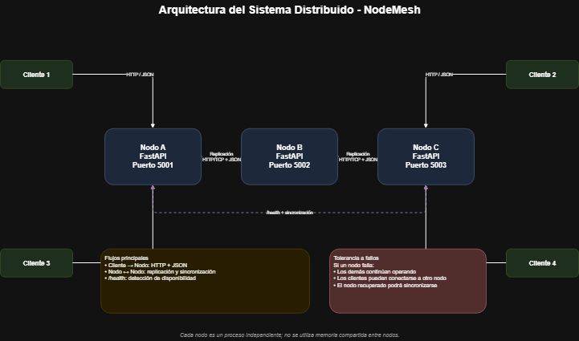
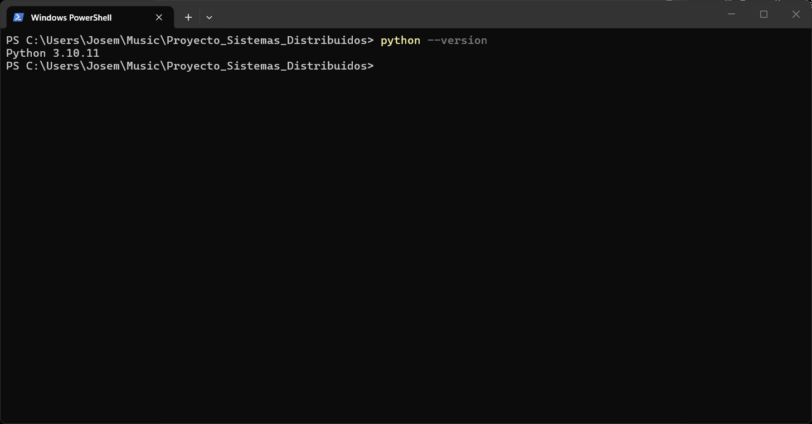

# NodeMesh - Sistema de Chat Distribuido



## Proyecto de Sistemas Distribuidos

NodeMesh es la adaptación de un proyecto de chat cliente-servidor desarrollado en Python hacia una arquitectura distribuida.

## Arquitectura del sistema

### ¿Cuántos nodos tendrá el sistema?

El sistema estará compuesto por 3 nodos independientes: Nodo A, Nodo B y Nodo C.

Durante las pruebas locales se utilizarán los siguientes puertos:

- Nodo A: puerto 5001
- Nodo B: puerto 5002
- Nodo C: puerto 5003

Cada nodo ejecutará su propia instancia de FastAPI como un proceso independiente.

### ¿Cómo se van a comunicar?

Los nodos se comunicarán mediante HTTP sobre TCP utilizando una API REST desarrollada con FastAPI.

La información será intercambiada en formato JSON. Los nodos no utilizarán memoria compartida; toda la comunicación entre ellos se realizará mediante la red.

Esto permitirá intercambiar información relacionada con usuarios, salas, mensajes, estado de los nodos y sincronización del sistema.

### ¿Qué pasa si uno falla?

Si uno de los nodos deja de funcionar, los demás nodos continuarán operando.

Los nodos podrán comprobar la disponibilidad de otros nodos mediante endpoints de diagnóstico como:

`GET /health`

Si un cliente pierde la conexión con el nodo que estaba utilizando, podrá conectarse a otro nodo disponible.

Durante el desarrollo del proyecto se implementará replicación y sincronización de información entre los nodos para mejorar la tolerancia a fallos y permitir que un nodo pueda reincorporarse al sistema después de recuperarse.

## Versión de Python

El proyecto utiliza Python 3 como lenguaje principal de desarrollo.

La versión instalada y utilizada para el proyecto se muestra en la siguiente evidencia:



## Tecnologías utilizadas

El proyecto utiliza las siguientes herramientas y tecnologías:

- Python 3
- FastAPI
- Uvicorn
- Docker Desktop
- GitHub
- Postman
- ngrok
- draw.io

## Estructura del proyecto

La estructura inicial del proyecto es la siguiente:

````text
Proyecto_Sistemas_Distribuidos/
├── capturas/
│   └── python_version.png
├── cliente/
├── diagramas/
│   ├── arquitectura_distribuida.drawio
│   └── arquitectura_distribuida.png
├── nodo/
│   └── Main.py
├── postman/
│   ├── collections/
│   └── environments/
├── pruebas/
├── .gitignore
├── README.md
└── requirements.txt

Cada carpeta tiene una función específica dentro del proyecto:

- `nodo/`: contiene la aplicación FastAPI correspondiente a los nodos del sistema.
- `cliente/`: contendrá el cliente que se comunicará con los nodos.
- `diagramas/`: contiene el diagrama de arquitectura y su archivo editable.
- `capturas/`: contiene evidencias solicitadas durante el desarrollo.
- `postman/`: contiene las colecciones y entornos utilizados para probar la API.
- `pruebas/`: se utilizará para pruebas adicionales del sistema.
- `requirements.txt`: contiene las dependencias de Python necesarias para ejecutar el proyecto.

## Estado actual del desarrollo

Actualmente se encuentra implementado el primer nodo del sistema distribuido.

El Nodo A utiliza FastAPI y se ejecuta localmente en el puerto `5001`.

Hasta el momento se encuentran disponibles los siguientes endpoints:

- `GET /`: muestra información general del nodo.
- `GET /health`: permite comprobar si el nodo se encuentra disponible.
- `GET /estado`: muestra información sobre el estado y tiempo de actividad del nodo.

El Nodo A puede ejecutarse con el siguiente comando:

```bash
uvicorn Main:app --host 0.0.0.0 --port 5001
````
